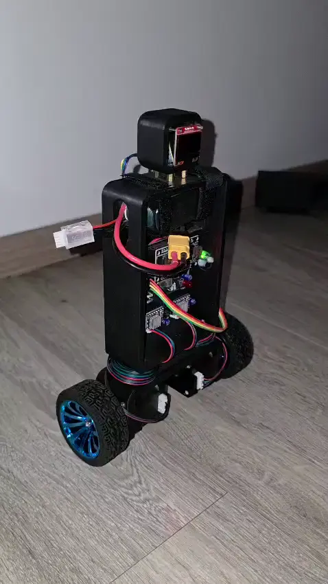

# Self-Balancing-Robot-

--FRANCAIS--

Ce projet à été réalisé individuellement en parallèle de mes études, reprend un projet que nous avions réalisé en ING1 à l'ECE Paris. Mais cette fois, au lieu de tout avoir déjà donné et pensé dans un kit, je me suis lancé le défi de tout faire moi même, de A à Z, de la 3D à la création du PCB, au codage du PID. Voici le résultat final : 

--ENGLISH

I carried out this project independently alongside my studies, revisiting a project we had originally completed during our first year of engineering school (ING1) at ECE Paris. This time, however, instead of using a kit where everything was pre-designed and provided, I challenged myself to build the entire thing from scratch—from 3D modeling and PCB design to programming the PID controller. Here is the final result : 

  

  

--FRANCAIS--
Si souhaité, ce robort peut-être transformé en robot télécommandé, il suffit simplement de créer un serveur web sur l'EPS32 et d'y ajouter une modification de la consigne d'angle, ou de set un pitch/roll cible. 

--ENGLISH

If desired, this robot can be converted into a remote-controlled robot; you simply need to create a web server on the ESP32 and add a way to modify the angle setpoint or specify a target pitch/roll.
